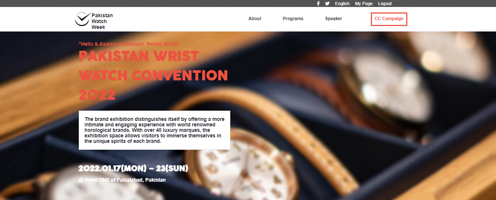

# Pakistan Watch Week 2022 Web Application

> This web app is specially created for Pakistan Watch Week 2022. It basically shares information about the Expo such as

- Workshops
- Forum
- PWW Ignite
- Exhibitions

## Built With

- HTML
- CSS
- JavaScript

## Get Live Demo

[Live Demo Link](https://hammas-saleem.github.io/Pakistan-Watch-Week-2022/)

## Authors

👤 **HAMMAS BIN SALEEM**
- GitHub: [@HAMMAS-SALEEM](https://github.com/HAMMAS-SALEEM)
- Twitter: [@HammasSaleem4](https://twitter.com/HammasSaleem4)
- LinkedIn: [HAMMAS SALEEM](https://www.linkedin.com/in/hammas-saleem-407)

## 🤝 Contributing
Contributions, issues, and feature requests are welcome!
Feel free to check the [issues page](../../issues/).

## Show your support
Give a ⭐️ if you like this project!

## Acknowledgments
Original design is from [Cindy Shin](https://www.behance.net/gallery/29845175/CC-Global-Summit-2015).
